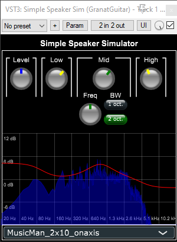

# ggconvolver
Simple VST3 impulse response plugin with a few hard coded impulse responses. It uses the JUCE convolution engine https://docs.juce.com/master/classdsp_1_1Convolution.html

The IR wav files are added to the JUCE project as binary resources. JUCE automatically converts it to binary data that can be used instead of reading the files in runtime (since I want the IRs to be hard coded).

The impulse responses are either recorded by me or found on the internet and given away
for free without any reservations (at least I couldn't find any). The reason for me to 
hard code the IRs (other than to learn plugin development with JUCE) is that I already
have several plugins where I can load IR files. I wanted a simple speaker plugin that
suits me and works out of the box.

I have only tested the plugin on Reaper.

### Versions

v0.1:
* Basic convolving with hardcoded impulse responses.
* Equalizer with low and high shelf filter and mid filter with variable frequency and bandwidth.
* Parameters are stored so they are saved when the DAW project is saved.

v0.2:
* Fancy graph plotting the EQ curve to visualize the EQ settings
* Output frequency analyser

### Todo

Prio:
* Move to JUCE6
* Use Cmake to build
* cppcheck
* I'm having some problem where sometimes it gets distorted after a while. Check code for memory/buffer/other issues.

Nice to have:
* Would like some VU meters (like I have in the https://github.com/tgranat/vstplugin_dev/tree/master/ggconvolver that I made using the VST SDK)
* Add more bandwidth options. Will probably use a dropdown instead of radio buttons
* In the future: load IR from file (but keep hardcoded options)

### Other Licenses

The implementation of the frequency analyser part contains code from the Frequaliser project by Daniel Walz
https://github.com/ffAudio/Frequalizer

Copyright (c) 2018, Daniel Walz - Foleys Finest Audio UG All rights reserved.

Redistribution and use in source and binary forms, with or without modification, 
are permitted provided that the following conditions are met:

1. Redistributions of source code must retain the above copyright notice, this list 
of conditions and the following disclaimer.

2. Redistributions in binary form must reproduce the above copyright notice, 
this list of conditions and the following disclaimer in the documentation 
and/or other materials provided with the distribution.

3. Neither the name of the copyright holder nor the names of its contributors
may be used to endorse or promote products derived from this software without 
specific prior written permission.

THIS SOFTWARE IS PROVIDED BY THE COPYRIGHT HOLDERS AND CONTRIBUTORS "AS IS" AND 
ANY EXPRESS OR IMPLIED WARRANTIES, INCLUDING, BUT NOT LIMITED TO, THE IMPLIED
WARRANTIES OF MERCHANTABILITY AND FITNESS FOR A PARTICULAR PURPOSE ARE DISCLAIMED. 
IN NO EVENT SHALL THE COPYRIGHT HOLDER OR CONTRIBUTORS BE LIABLE FOR ANY DIRECT, 
INDIRECT, INCIDENTAL, SPECIAL, EXEMPLARY, OR CONSEQUENTIAL DAMAGES (INCLUDING, 
BUT NOT LIMITED TO, PROCUREMENT OF SUBSTITUTE GOODS OR SERVICES; LOSS OF USE,
DATA, OR PROFITS; OR BUSINESS INTERRUPTION) HOWEVER CAUSED AND ON ANY THEORY OF 
LIABILITY, WHETHER IN CONTRACT, STRICT LIABILITY, OR TORT (INCLUDING NEGLIGENCE 
OR OTHERWISE) ARISING IN ANY WAY OUT OF THE USE OF THIS SOFTWARE, EVEN IF ADVISED 
OF THE POSSIBILITY OF SUCH DAMAGE.
